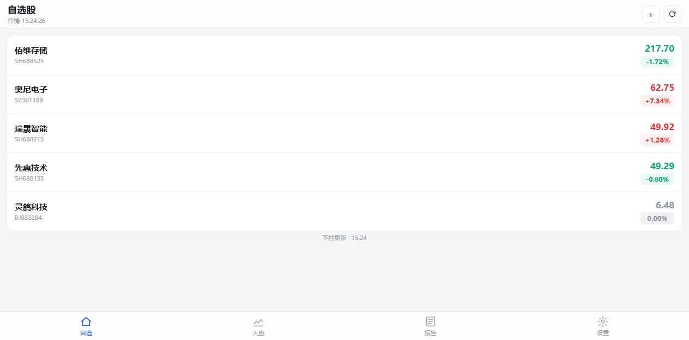
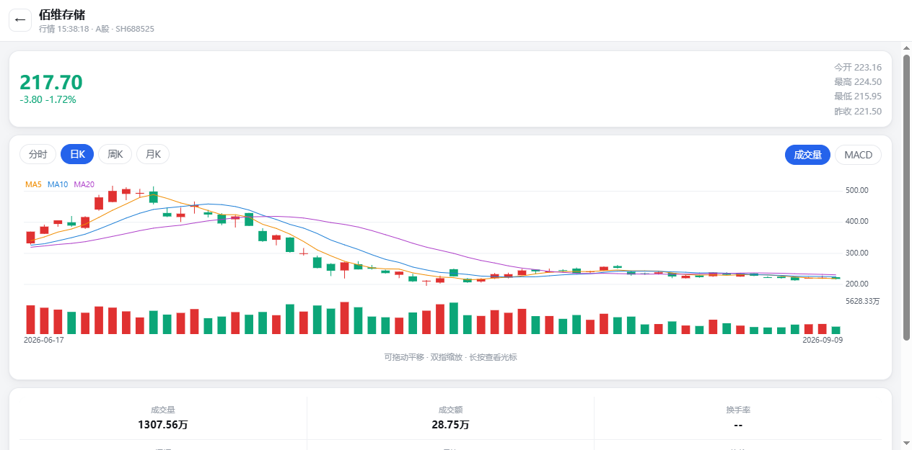
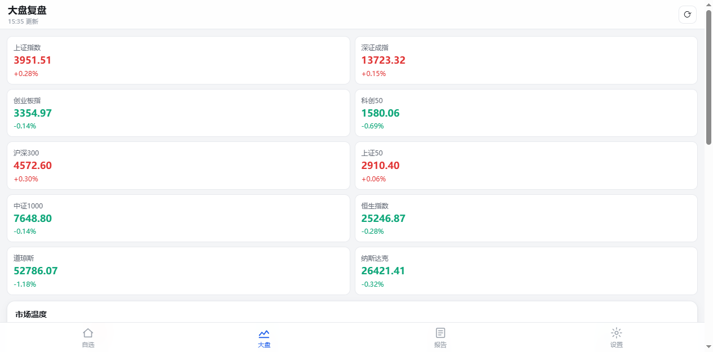

# DSA Mobile — daily_stock_analysis 安卓手机版

> [ZhuLinsen/daily_stock_analysis](https://github.com/ZhuLinsen/daily_stock_analysis)（LLM 驱动的多市场股票智能分析系统）的手机端移植版本。
> 纯原生 HTML/JS/Canvas 实现，零第三方依赖，零构建，可直接打包 APK。





## 功能

| 模块 | 说明 |
|------|------|
| 自选股 | 添加/删除/排序，实时行情自动刷新（A 股 / 港股 / 美股 / 北交所） |
| 行情详情 | 分时（价格+均价+量）、日K/周K/月K（MA5/10/20 + 成交量/MACD），支持拖动平移、双指缩放、长按十字光标 |
| AI 决策报告 | 一键生成：核心结论、评分环、买卖点/止损/目标位、风险警报、利好催化、数据视角、持仓应对、操作检查清单、交易节奏。输出结构与上游 `AnalysisReportSchema.dashboard` 完全对齐 |
| 大盘复盘 | 10 个主要指数、涨停/跌停家数、领涨领跌板块榜、自选概览、AI 复盘点评（500 字四段式） |
| 双模式 | **手机直连**（装完即用，无需服务器）/ **服务器模式**（连接电脑上的 FastAPI 工作台） |
| 报告管理 | 本地缓存、复制推送简报（Markdown，排版对齐上游企业微信推送模板）、查看原文 JSON |

约定：红涨绿跌（中国习惯）；报告仅供参考，不构成投资建议。

## 目录结构

```
dsa-android/
├── app/                    # PWA 主体（同时是 APK 的 assets 源）
│   ├── index.html
│   ├── manifest.webmanifest / sw.js
│   ├── css/app.css
│   ├── js/
│   │   ├── util.js         # JSONP、DOM、格式化、Toast、Markdown 渲染
│   │   ├── store.js        # 配置/自选股/报告缓存（localStorage）
│   │   ├── quote.js        # 腾讯行情/K线/分时 + 东财搜索/指数/板块/涨跌停 + 技术指标
│   │   ├── chart.js        # 零依赖 Canvas K线/分时图
│   │   ├── llm.js          # OpenAI 兼容/DeepSeek/通义/Kimi/Gemini/Claude 客户端 + 可选联网搜索
│   │   ├── analyzer.js     # 决策报告引擎（对齐上游 dashboard schema）
│   │   ├── market.js       # 大盘复盘
│   │   ├── server.js       # FastAPI 服务器模式客户端
│   │   └── app.js          # 路由与页面
│   └── icons/
├── android/                # Android Studio 工程（WebView 壳，零第三方依赖）
├── tools/
│   ├── make_icons.py       # 生成 PWA/Android 图标（无 Pillow 依赖）
│   └── sync_assets.py      # app/ -> android assets 同步
├── .github/workflows/build-apk.yml   # GitHub Actions 自动构建 APK
└── docs/                   # 预览截图
```

## 快速开始

### 方式一：PWA（最快，2 分钟用上）

电脑上（与手机同一 Wi-Fi）：

```bash
cd app
python -m http.server 8777
# 查看电脑 IP：ipconfig（Windows）
```

手机浏览器访问 `http://<电脑IP>:8777` → 菜单里「添加到主屏幕」。之后从桌面图标全屏启动。

> 想长期用可以部署到任意静态托管（或用 `qianwenai-deploy` 等发布为在线链接）。

### 方式二：构建 APK（GitHub Actions，无需本地环境）

1. 把整个 `dsa-android` 目录推到你自己的 GitHub 仓库
2. 仓库 → Actions → **Build APK** → Run workflow
3. 完成后在 Artifacts 下载 `dsa-mobile-apk`（debug 签名，直接安装）

### 方式三：本地 Android Studio 构建

1. Android Studio（Hedgehog+/JDK 17）→ Open → 选择 `android` 目录
2. 先执行一次 `python tools/sync_assets.py`（改了 `app/` 下任何文件后都要重新同步）
3. Run / Build APK

## 配置

进入「设置」：

1. **大模型**：选预设（推荐 DeepSeek，`deepseek-chat`，便宜且支持 JSON 输出），填 API Key，点「测试连通」。Key 只存在本机。
   - 预置：DeepSeek / OpenAI / 通义千问 / Kimi / 豆包方舟 / AIHubMix / Anspire / Gemini / Claude / Ollama / 自定义
2. **联网搜索（可选）**：开 Tavily 或博查，分析时自动带新闻/公告，结论更准，额外耗 Token
3. **自选股管理**：增删排序；默认预置 5 只自选
4. **外观**：深色主题、自动刷新频率、报告详细程度（完整/精简）

**服务器模式**（可选）：电脑上运行上游项目 `python main.py --webui`，App 设置里切到「服务器模式」填 `http://电脑IP:8000`，测试连接后即可把分析任务交给服务器执行（需手机与电脑同局域网；服务端 FastAPI 已带跨域配置）。

## 数据源与已知限制

| 数据 | 来源 | 方式 |
|------|------|------|
| 实时行情 | 腾讯 `qt.gtimg.cn` | JSONP（GBK） |
| K线/分时 | 腾讯 `web.ifzq.gtimg.cn` | JSONP |
| 股票搜索 | 东财 `searchapi` | JSONP |
| 指数/板块 | 东财 `push2delay`（镜像） | JSONP |
| 涨跌停家数 | 东财 `push2ex` | JSONP |

- 指数/板块走东财 delay 镜像，行情延迟约 1 分钟（push2 主域拒绝浏览器跨站 script，delay 镜像对网页端开放）；腾讯实时行情无延迟
- 免费源受上游限流影响，稳定性不保证；美股后缀自动尝试 `.OQ`/`.N`
- 全市场涨跌家数无免费单接口，暂以「涨停/跌停家数 + 自选涨跌统计 + 板块榜」呈现
- AI 分析质量取决于所配模型；直连模式下请自行确认浏览器/WebView 能访问所选 API 域名

## 与上游的对应关系

- 报告 JSON 与上游 `src/schemas/report_schema.py` 的 `AnalysisReportSchema.dashboard` 字段一一对应（core_conclusion / data_perspective / intelligence / battle_plan / phase_decision / signal_attribution）
- 简报导出排版对齐上游 `templates/report_wechat.j2`（决策仪表盘）
- 服务器模式直接调用上游 FastAPI：`POST /api/v1/analysis/analyze`、`POST /api/v1/analysis/market-review`、`GET /api/v1/analysis/status/{id}`、`/api/v1/stocks/watchlist*`

## License

MIT。上游项目版权归 ZhuLinsen 所有，行情数据来自腾讯/东方财富公开接口，仅供个人研究学习。
